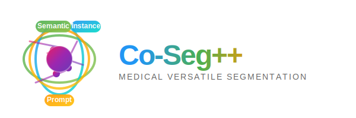

# *Co-Seg++*: Mutual Prompt-Guided Collaborative Learning for Versatile Medical Segmentation
<p align="center">
  
</p>


### [ArXiv Paper]() 

[Qing Xu](https://scholar.google.com/citations?user=IzA-Ij8AAAAJ&hl=en&authuser=1)<sup>1</sup> [Yuxiang Luo]()<sup>2</sup> [Wenting Duan](https://scholar.google.com/citations?user=H9C0tX0AAAAJ&hl=en&authuser=1)<sup>3</sup> [Zhen Chen](https://franciszchen.github.io/)<sup>4✉</sup> 

<sup>1</sup>UNNC &emsp; <sup>2</sup>Sichuan University &emsp; <sup>3</sup>Univeristy of Lincoln &emsp; <sup>4</sup>HKISI, CAS &emsp;

<sup>✉</sup> Corresponding Author. 

-------------------------------------------


## 📰News

- **[2025.06.03]** We have released the code for Co-Seg++ !
## 🛠Setup

```bash
git clone https://github.com/xq141839/Co-Seg-Plus.git
cd Co-Seg-Plus
conda create -f Co-Seg-Plus.yaml
```

**Key requirements**: Cuda 12.2+, PyTorch 2.4+, mamba-ssm 2.1.0+

## 📚Data Preparation
- **PUMA**: [https://challenge.isic-archive.com/data/#2018](https://challenge.isic-archive.com/data/#2018)

The data structure is as follows.
```
HRMedSeg
├── datasets
│   ├── image_1024
│     ├── training_set_metastatic_roi_001.png
|     ├── ...
|   ├── mask_sem_1024
│     ├── training_set_metastatic_roi_001_nuclei.npy
|     ├── ...
|   ├── mask_ins_1024
│     ├── training_set_metastatic_roi_001_tissue.npy
|     ├── ...
|   ├── data_split.json
```
The json structure is as follows.

    { 
     "train": ['training_set_metastatic_roi_061.png'],
     "valid": ['training_set_metastatic_roi_002.png'],
     "test":  ['training_set_metastatic_roi_009.png'] 
     }

## 🎪Quickstart
* Train the Co-Seg++ with the default settings:
```python
python train.py --dataset data/$YOUR DATASET NAME$ --sam_pretrain pretrain/$SAM2 CHECKPOINT$
```

## Acknowledgements

* [SAM2](https://github.com/facebookresearch/sam2)
* [Medical-SAM-Adapter](https://github.com/SuperMedIntel/Medical-SAM-Adapter)
* [MambaVision](https://github.com/NVlabs/MambaVision)


